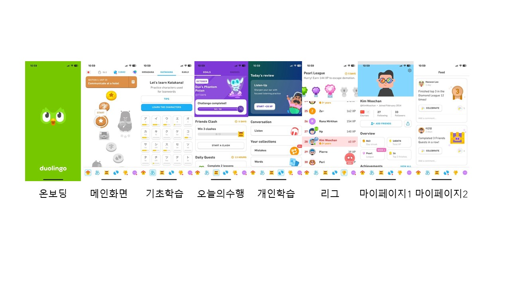
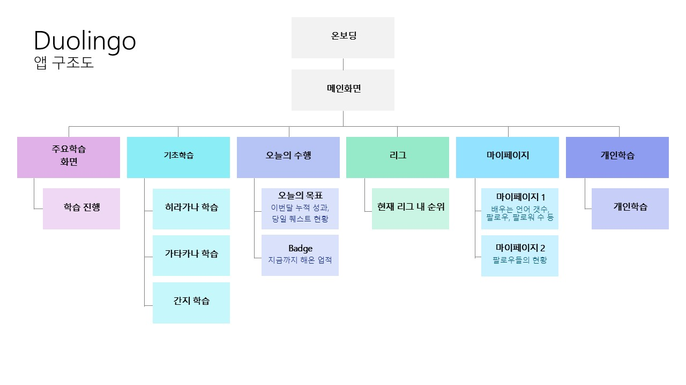
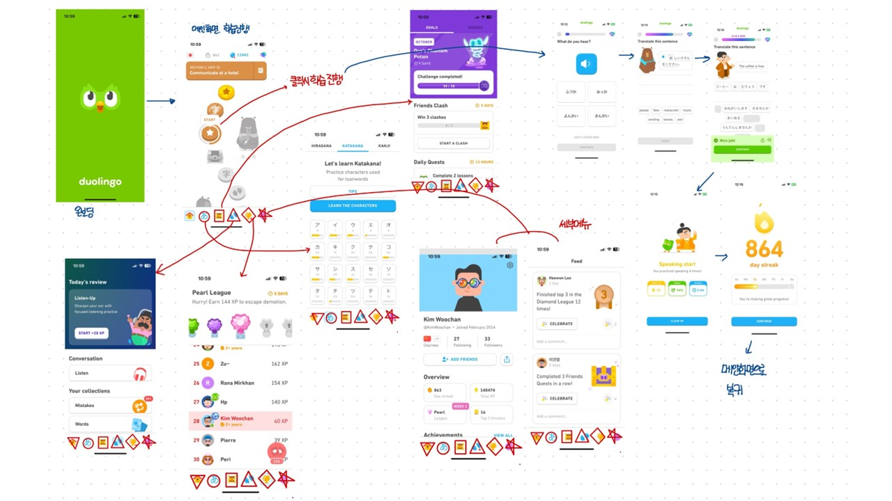

# 듀오링고 앱분석
## 앱 정보
- 듀오링고
## 시장성
- 전 세계적인 사용자 기반: 듀오링고는 수억 명의 사용자를 보유하고 있으며, 다양한 문화와 언어권에서 사용됩니다.
- 온라인 교육 시장의 성장: 디지털 학습에 대한 수요 증가로 인해 온라인 교육 플랫폼의 시장 규모가 확대되고 있습니다.
- 프리미엄 서비스 모델: 기본적으로 무료로 제공되지만, 광고 제거 및 추가 기능을 위한 유료 구독 서비스를 통해 수익을 창출합니다.
- 파트너십 및 인증 프로그램: 교육 기관 및 기업과의 협력을 통해 공식 인증을 제공하여 신뢰성을 높였습니다.

## 주요 타겟
- 언어 학습자: 새로운 언어를 배우고자 하는 학생, 직장인, 여행자 등 다양한 연령대의 개인.
- 자기계발에 관심 있는 사람들: 시간과 장소에 구애받지 않고 학습하고자 하는 사람들.
- 교육 기관 및 단체: 학교나 기업에서 보조 학습 도구로 활용하기 위해 도입하는 경우도 있습니다.

## 특징 
- 게임화된 학습 경험: 레벨업, 보상 시스템, 일일 목표 설정 등 게임 요소를 도입하여 학습 동기를 부여합니다.
- 다양한 언어 지원: 영어, 스페인어, 프랑스어 등 주요 언어뿐만 아니라 클링온어, 하이발리리아어 같은 특이한 언어도 제공합니다.
- 개인화된 학습 경로: 인공지능을 활용하여 개인의 학습 패턴과 수준에 맞는 콘텐츠를 제공합니다.
- 커뮤니티 기능: 토론 포럼과 친구 추가 기능을 통해 다른 학습자들과 소통하고 경쟁할 수 있습니다.
- 접근성: 모바일 앱과 웹 플랫폼 모두 지원하여 언제 어디서나 학습이 가능합니다.

## 앱 구조도
 


## 앱 와이어프레임 (사용 툴 : 굿노트)


## 프로토타이핑 (사용 툴 : 마블앱)


## 페이지 구현
1. main.dart에 모든 것을 다 구현하였습니다.
    - OnBoardingScreen - 온보딩 화면으로 2초 후 메인 화면으로 자동으로 넘어가게 설정하였습니다.
    - main - 메인 화면, 캡쳐본으로 하단의 아이콘을 통해 다른 화면으로 이동할 수 있게 설정하였습니다.
    - page2~6 ; 동일한 하단 앱아이콘 사용하여 이동할 수 있도록 설정하였습니다.

## 구현영상


## 참고 학습 자료
- GPT O1

## 회고
- 플러터가 익숙하지 않아 어렵지만, 앱을 만들어볼 수 있는 가벼운 프로젝트라서 재밌었습니다.
- 하단의 아이콘을 실제 듀오링고의 이미지로 만들어보려고 했는데, 해결되지 않는 오류들이 계속 발생해서 결국 성공하지 못하였습니다.
- 추가적인 학습 진행이 필요합니다.
- 여러 다트파일을 종합적으로 운영하는 것에 대한 이해도가 부족합니다. 지금까지 모든 플러터 퀘스트를 main.dart안에 구성하였는데, 앱이 커지면 이렇게 운영하면 안될 것 같지만.. 어떻게 해야할지 잘 모르겠습니다.


# AIFFEL Campus Online Code Peer Review Templete
- 코더 : 김우찬
- 리뷰어 : 윤석진


# PRT(Peer Review Template)
- [x]  **1. 주어진 문제를 해결하는 완성된 코드가 제출되었나요?**
    - 네, 완성된 코드가 잘 제출되어 있습니다.
    - 

- [x]  **2. 전체 코드에서 가장 핵심적이거나 가장 복잡하고 이해하기 어려운 부분에 작성된 
주석 또는 doc string을 보고 해당 코드가 잘 이해되었나요?**
    - 네, 2초 후 자동으로 화면으로 넘어가는게 가장 신기했고, 이 부분도 잘 이해되었습니다.
    - 

- [x]  **3. 에러가 난 부분을 디버깅하여 문제를 해결한 기록을 남겼거나
새로운 시도 또는 추가 실험을 수행해봤나요?**
    - 네, 프로젝트를 하면서 고충을 겪으신 부분이 잘 설명되어 있었습니다.
    - 

        
- [x]  **4. 회고를 잘 작성했나요?**
    - 네, 회고 또한 잘 작성되어 있었습니다.
    - 

- [x]  **5. 코드가 간결하고 효율적인가요?**
    - 네, 코드가 간결하고 효율적으로 잘 작성되어 있었습니다.
    - 

# 회고(참고 링크 및 코드 개선)
```
설명 동영상도 있고 정보 구조, 와이어프레임, 프로토타이핑 설명 이미지도 깔끔하게 되어있어서 전문적인 느낌이 났습니다!
잘 하신 것 같네요!
```
